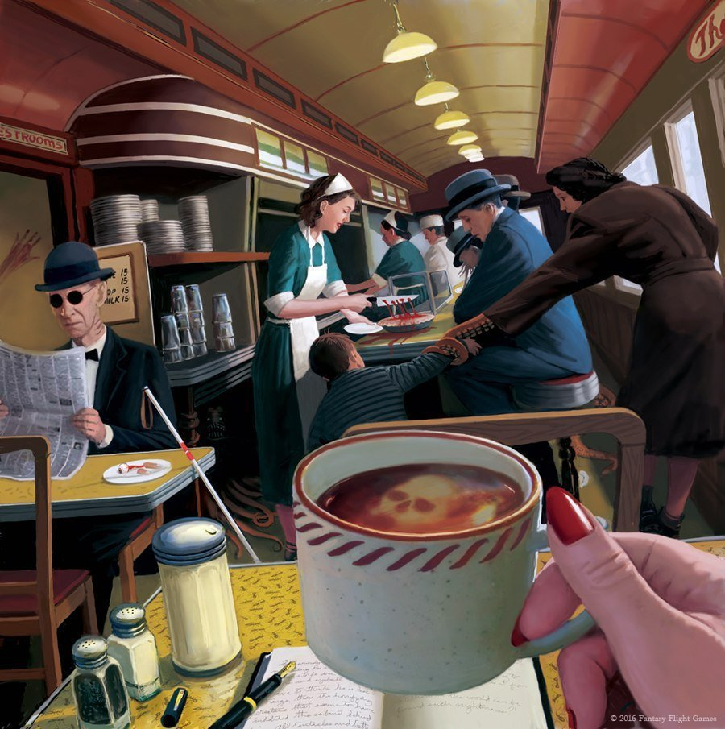

# Инструкция к MarkDown

## Выделение текста

Для выделения курсивом обромить текст *

Для выделения полужирным обрамить текст **

Для выделения зачеркнутого текста обрамить его ~~

*Жили были у бабуси*

**Два веселых гуся**

~~Один серый, один белый~~

**Два веселых гуся**

Так же для курсива можно использовать (_), а для полужирного (__).

_Таким образом можно **совмещать форматирование**_

## Списки

Для не нумеровоного списка использовать *

* Что-то
* Что-то ещё
* И конечно же ещё

Или  +

+ Другой вариант
+ Для сравнения

Для нумеровоного списка использовать цифры с точкой

1. Строка 1
2. Строка 2
3. Строка 3

Для многоуровнего списка использовать отступ

1. Первый уровень
    * Второй уровень
        * Третий уровень
            * Четвертый уровень

## Изображения

Для вставки изображения необходимо написать следующий текст:
'![Название](адрес изображения "Коментарий"

## Ссылки

Информация по ссылкам

## Работа с таблицами

## Цитаты

Для отображения цитат используется >

>Быть или не быть, вот в чем вопрос.

Для включение нескольких обзацев использовать между ними >

>Цитата 1
>
>Цитата 2

## Заключение
